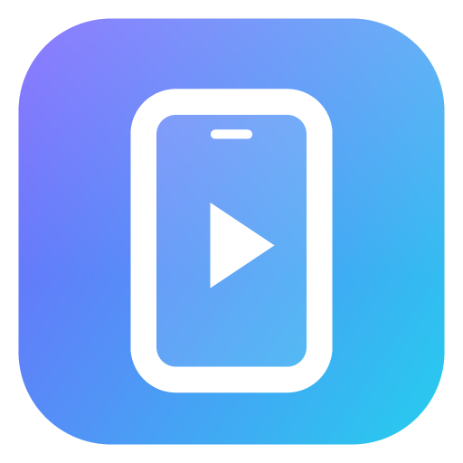

# Scrcpy Studio

A polished, full-featured desktop GUI for [scrcpy](https://github.com/Genymobile/scrcpy) and adb.
Mirror, record, control and manage your Android devices from one place.



## Features

**Phone Link (Windows): phone as webcam, microphone and speakers**
- A small separate window with its own desktop shortcut (Phone Link → "Desktop shortcut", or run the app with `--link`). Also in the tray, the rail and Ctrl+K
- Three independent switches, each its own stream, so the phone only works for what is on:
  - **Webcam** → "Scrcpy Studio Camera" (optional NDI), live preview with lens switching (.5 / 1× / front), tap to focus, zoom, exposure, focus, white balance, torch, mirror, fill, stabilisation, 720p/1080p and a Pro section (ISO / shutter / anti-flicker). Settings are shared with Camera Studio
  - **Mic** → a virtual cable microphone (e.g. "CABLE Output"), an NDI audio source, or a PC output for listening. Natural / Voice (noise + echo reduction) / Raw modes, level meter
  - **Speakers** → plays Windows sound on the phone in stereo (48 kHz). With a virtual cable it becomes a separate "phone speakers" output, made the Windows default while on and restored after; without one the phone mirrors what a PC output plays. Phone volume slider
- Virtual cables are detected automatically (VB-CABLE, CABLE A/B, Hi-Fi Cable, VoiceMeeter, Virtual Audio Cable). The mic gets the first one, the speakers the next one
- Windows only lists microphones and speakers that have a driver, which is why a separate mic/speaker device needs a virtual cable driver; the webcam does not

**Virtual webcam + microphone (Windows)**
- One click turns the phone into **"Scrcpy Studio Camera"**, a real webcam device for vMix, Discord, Zoom, Teams, OBS, Chrome/Edge and most Windows apps (DirectShow, 64- and 32-bit apps). It shows a "camera offline" card when the phone isn't streaming, so apps can always open it
- **NDI output** (video + audio) when NDI Tools are installed: native in vMix/OBS, and through NDI Webcam a camera *and* microphone for every app
- The phone microphone can be played into any audio device, e.g. a virtual audio cable (VB-CABLE), whose other end becomes a microphone in Discord & co.
- No scrcpy window needed: a native bridge decodes the stream with the Windows H.264 decoder. All pro camera controls keep working live
- Install once from Camera Studio → Virtual webcam → Install (asks for administrator permission)

**Camera Studio (pro mode + webcam)**
- Uses your phone camera as a webcam window (capture it in OBS → Start Virtual Camera), with **live manual controls** like a native Pro mode:
  ISO, shutter speed, EV, manual focus (distance scale) and tap-to-focus, Kelvin white balance + tint, zoom, lens switching (ultra-wide / wide / front)
- Metering (matrix / center / spot), AF modes, OIS / EIS, anti-flicker (50/60 Hz), noise reduction, sharpening, contrast, saturation, effects, scene modes, torch, AE/AWB lock
- In-app live preview with histogram, a HUD with the real ISO/shutter/Kelvin/focus chosen by the phone, grid overlay, and saved "Looks"
- Output: 4K/1080p/720p/4:3, 15–30 fps and high-speed 120/240 fps, rotation, microphone audio, borderless/always-on-top window, recording
- Only offers what each lens supports (read from the phone's Camera2 capabilities)

How it works: Scrcpy Studio ships a patched build of the scrcpy server (`native/server-overlay`, built by `npm run build:server`). It is the official server of the same version plus a small extension that applies Camera2 settings from a control file on the device and reports live readings. It is only used for camera sessions; everything else uses the stock server.

**Mirroring**
- One-click mirroring from device cards, the title bar (`Ctrl+M`), the tray, or the command palette
- 9 built-in profiles (Balanced, High quality, Low-latency gaming, Wi-Fi saver, Screen off, Presentation, Desktop mode, Camera, View only) plus unlimited custom profiles with import/export
- A complete editor for **every scrcpy 4.x option** (video, audio, input, window, device, virtual display, camera, recording, advanced) with search, per-section change counters, live colored command preview and conflict warnings
- Options scrcpy would reject in the current context (e.g. camera options without a camera source, `--stay-awake` in view-only mode) are skipped automatically; version-gated options are hidden for older scrcpy
- "Detect from device" fills encoders, displays, cameras/sizes and installed apps into the editor
- Quick modes: screen-off mirror, record, background (headless) recording, audio only, camera, virtual display, OTG keyboard & mouse
- Open any app in **its own window** on a virtual display
- Per-device default profile, multiple simultaneous sessions

**Sessions** — live list with status, elapsed time, resolution, graceful stop (recordings are finalized), force kill, relaunch and full logs (copy/save).

**Devices & wireless**
- Auto-detected devices with model, Android version, resolution, battery and connection type; rename devices
- Clear guidance for unauthorized/offline devices
- Wi-Fi: connect by IP, one-click **USB → Wi-Fi switch**, Android 11+ pairing by **code** or **QR code**, mDNS discovery, remembered history with auto-reconnect

**Device tools**
- **Remote control**: navigation/power/volume/media keys, text input, paste PC clipboard, quick settings tiles (Wi-Fi, Bluetooth, data, airplane, dark mode, auto-rotate, stay awake, show touches…), brightness, screen timeout, font size, animation speed, resolution/density overrides, reboot to system/recovery/bootloader, shortcuts to device settings pages
- **Apps**: user/system/disabled/favorites filters, launch, force stop, mirror in own window, details, extract APK, clear data, disable/enable, uninstall; install APKs (drag & drop anywhere)
- **Files**: browse storage, quick places, upload (drag & drop), download, open on PC, rename, delete, new folder, keyboard shortcuts
- **Shell**: streaming adb shell with history and an editable quick-command library
- **Logcat**: live, level/text/regex/package filters, highlight, follow, save
- **Device info**: battery, memory, storage, CPU, display, uptime + all system properties
- **Media**: gallery of screenshots and recordings with lightbox, copy to clipboard, trash

**App** — dark/light/system themes with accent colors, command palette (`Ctrl+K`), keyboard shortcuts, system tray, desktop notifications, settings export/import.

## Download

Get the latest build from [Releases](https://github.com/ShadowAugust/ScrcpyStudio/releases/latest):

- **ScrcpyStudio-Setup-x.y.z.exe**: installs per user (no admin needed) and updates itself in place
- **ScrcpyStudio-Portable.exe**: a single exe to run from anywhere; updates download the new exe and swap it on restart

## Updates

At startup the app checks GitHub Releases (can be turned off in Settings → Updates) and suggests a new version with its release notes: **Update now**, **What's new** or **Skip this version**. You can also check manually from Settings → Updates, the tray menu or Ctrl+K → "Check for updates". The Phone Link window shows a small banner too.

## Releasing

Bump the version and push the tag; the GitHub Actions workflow builds the installer and portable exe and publishes the release (with `latest.yml` for the updater):

```bash
npm version patch
git push --follow-tags
```

The native parts in `resources/` (Studio scrcpy server, virtual camera DLLs, `studio-vcam.exe`) are committed prebuilt, so CI only needs Node. Rebuild them locally with `npm run build:server` / `npm run build:vcam` when you change them.

## Requirements

- [scrcpy](https://github.com/Genymobile/scrcpy/releases) 2.x+ (4.x recommended). Auto-detected from PATH, winget, scoop, chocolatey, or set manually in Settings. The adb bundled with scrcpy is used by default.
- Node.js 18+ (to run from source)

## Run

```bash
npm install
npm start
```

Build a Windows installer + portable exe:

```bash
npm run dist
```

Output goes to `dist/` (NSIS installer and a portable `.exe`).

## Shortcuts

| Action | Keys |
| --- | --- |
| Command palette | `Ctrl+K` |
| Mirror selected device | `Ctrl+M` |
| Record selected device | `Ctrl+Shift+R` |
| Screenshot | `Ctrl+Shift+S` |
| Navigate pages | `Ctrl+1…9` |
| Settings | `Ctrl+,` |
| Refresh devices | `F5` |

## Rebuilding the camera server

Needed only if you update scrcpy (the server must match the client version exactly). Requires git, JDK 17+ and the Android SDK (platform + build-tools):

```bash
SCRCPY_VERSION=4.1 npm run build:server
```

## Rebuilding the virtual webcam

Requires Visual Studio 2022 with "Desktop development with C++" (builds the softcam-based DirectShow camera for x64/x86 and the `studio-vcam.exe` bridge):

```bash
npm run build:vcam
```

`node scripts/build-vcam.js --bridge` rebuilds only `studio-vcam.exe`. The phone-side speaker player (`com.genymobile.scrcpy.studio.Speaker`) is part of the Studio server jar (`npm run build:server`).

## Development

- `src/main` — Electron main process (`adb.js`, `scrcpy.js`, `pairing.js`, `store.js`, `tools.js`, `preload.js`)
- `src/renderer` — UI (vanilla ES modules, no build step). `js/options.js` is the declarative scrcpy option schema.
- `npm run preview` serves the UI in a browser with a demo backend (`js/mock-api.js`).
- `bash scripts/capture.sh out/` renders every view with demo data to PNGs.
- `npm run icons` regenerates the icon subset and the app icon.
